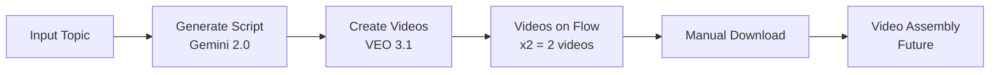

# 🎬 VEO 3.1 Complete Tool - Comet Version

## ✅ ĐÃ HOÀN THÀNH

### 📦 Files chính

| File | Mô tả | Cách dùng |
|------|-------|-----------|
| **RUN_WITH_COMET.py** | Tool chính với Comet browser | `python RUN_WITH_COMET.py` |
| **HOW_TO_RUN.md** | Hướng dẫn chi tiết | Đọc để hiểu đầy đủ |
| **QUICK_START_COMET.md** | Hướng dẫn nhanh | Chạy nhanh trong 3 bước |

### 🎯 Tính năng

✅ **Script Generation** - Gemini 2.0 Flash tạo kịch bản
✅ **Video Creation** - VEO 3.1 tạo videos
✅ **Comet Browser** - Chạy với Comet để debug
✅ **Cookie Auth** - Tự động login vào Flow
✅ **Project Management** - Tạo hoặc dùng project có sẵn
⚠️ **x2 Setting** - Flow mặc định tạo 2 videos (chưa tự động đổi)
❌ **Auto Download** - Chưa tự động download videos
❌ **Video Assembly** - Chưa ghép video thành phim

## 🚀 Cách chạy nhanh

```bash
# 1. Activate
cd /Users/macos/Desktop/VEO2
source venv312/bin/activate

# 2. Run
python RUN_WITH_COMET.py

# 3. Open browser
# http://localhost:7860
```

## 🌐 Comet Browser Features

### ✅ Ưu điểm
- **Visible**: Thấy được browser đang làm gì
- **Debug**: Dễ dàng inspect và debug
- **Monitor**: Theo dõi tiến trình real-time

### ⚠️ Lưu ý
- Browser window sẽ mở (không chạy background)
- Cần Comet đã cài: `/Applications/Comet.app`
- Sử dụng Selenium + webdriver-manager (tự động cài đúng ChromeDriver version)
- Nếu không có Comet: Đổi binary_location sang Chrome trong `flow_controller_selenium.py`

## 📋 Workflow



## 🔧 Technical Stack

| Component | Technology | Status |
|-----------|-----------|--------|
| Browser | Comet (Chromium) | ✅ |
| Automation | Selenium + webdriver-manager | ✅ |
| Script Gen | Gemini 2.0 Flash API | ✅ |
| Video Gen | VEO 3.1 (Flow) | ✅ |
| UI | Gradio 5.x | ✅ |
| Python | 3.12.12 | ✅ |

## ⚠️ Known Issues

### 1. x2 Setting (2 videos per prompt)
**Vấn đề**: Flow mặc định tạo 2 videos cho mỗi prompt

**Giải pháp tạm thời**:
- Thay đổi thủ công trong Flow UI
- Hoặc chấp nhận 2 videos (delete 1 sau)

**Tại sao chưa tự động?**
- Selector phức tạp, cần click vào dropdown
- Menu popup không ổn định
- Cần thêm thời gian research

### 2. Auto Download
**Vấn đề**: Videos không tự động download về máy

**Giải pháp tạm thời**:
- Download thủ công từ Flow
- Videos vẫn có sẵn trên cloud

**Tại sao chưa tự động?**
- Download UI phức tạp
- Cần wait cho video processing (1080p takes time)
- Cần implement download monitoring

### 3. Video Assembly
**Vấn đề**: Chưa tự động ghép videos thành phim

**Giải pháp tạm thời**:
- Dùng tool khác để ghép (iMovie, Premiere, etc)

**Planned**:
- Dùng MoviePy để ghép
- Add transitions
- Add audio/music

## 📁 Project Structure

```
VEO2/
├── RUN_WITH_COMET.py          # Main file - Run this!
├── HOW_TO_RUN.md               # Detailed guide
├── QUICK_START_COMET.md        # Quick start
├── COMET_COMPLETE_SUMMARY.md   # This file
│
├── src/
│   ├── script_generator.py             # Gemini script generation
│   └── browser_automation/
│       ├── flow_controller.py          # Playwright version (Chrome)
│       └── flow_controller_selenium.py # Selenium version (Comet) ← USED
│
├── cookie.txt                  # Flow cookies (you create)
├── .env                        # API keys (you create)
│
└── Test Scripts/               # Development & debug
    ├── comet_full_auto.py
    ├── comet_set_output_count.py
    ├── comet_click_x2.py
    └── ...
```

## 🎓 Learning & Debug

### Debug Scripts (Tham khảo)
- `comet_full_auto.py` - Full workflow test
- `comet_set_output_count.py` - Test setting x1/x2
- `comet_click_x2.py` - Test clicking x2 element
- `comet_to_prompt.py` - Test up to prompt step

### Useful for:
- Hiểu cách tool hoạt động
- Debug khi có lỗi
- Customize thêm features

## 📊 Performance

### Script Generation
- **Thời gian**: 5-15 seconds
- **Model**: Gemini 2.0 Flash
- **Quality**: Tốt, có thể điều chỉnh prompt

### Video Creation
- **Thời gian/video**: 30-90 seconds
- **Model**: VEO 3.1 - Fast
- **Output**: 2 videos/prompt (x2)
- **Quality**: 8 seconds/video, 720p-1080p

### Total Time (Example)
```
Topic: "Làm phở" (1 minute movie)
- Script: ~10s
- Videos: 7 scenes × 60s = 7 minutes
- Total: ~8 minutes
```

## 🔄 Updates & Roadmap

### ✅ Completed
- [x] Comet browser integration
- [x] Cookie authentication
- [x] Script generation (Gemini)
- [x] Video creation (VEO 3.1)
- [x] Project management
- [x] UI with Gradio

### 🚧 In Progress
- [ ] Auto change x2 → x1 setting
- [ ] Better error handling
- [ ] Progress tracking improvements

### 📅 Planned
- [ ] Auto download videos
- [ ] Video assembly (MoviePy)
- [ ] Scene regeneration UI
- [ ] Batch processing
- [ ] Templates & presets

## 💡 Tips & Tricks

### 1. Cookie Management
```bash
# Re-export cookies khi hết hạn
# Check expiry trong cookie.txt
# Nếu lỗi auth → Export lại
```

### 2. Project IDs
```bash
# Dùng project có sẵn → Paste ID
# Tạo mới → Để trống
# Default fallback: 125966c7-418b-49da-9978-49f0a62356de
```

### 3. Prompt Engineering
```
Tốt: "Làm phở bò truyền thống Việt Nam"
Tốt hơn: "Quy trình làm phở bò Việt Nam từ đầu,
         từ nấu nước dùng đến thành phẩm"
```

## 📞 Support & Troubleshooting

### Common Errors

**Error: "Comet not found"**
```bash
# Check Comet installed
ls /Applications/Comet.app

# If not: Use Chrome instead
# Edit flow_controller.py: channel='chrome'
```

**Error: "Cookie expired"**
```bash
# Re-export cookies from browser
# Login to Flow first
# Use cookie export script
```

**Error: "ChromeDriver mismatch"**
```bash
# Script auto-downloads correct version
# If still error: Delete old chromedriver
rm /opt/homebrew/bin/chromedriver
# Run again
```

## 🎯 Best Practices

1. **Always check Comet window** - Xem lỗi gì real-time
2. **Keep cookies fresh** - Re-export mỗi vài ngày
3. **Use descriptive topics** - Giúp Gemini tạo script tốt hơn
4. **Monitor progress** - Đừng đóng browser giữa chừng
5. **Save project IDs** - Để dùng lại sau

## ✨ Summary

**VEO 3.1 Complete Tool with Comet** = Production-ready movie maker với browser debugging!

**Main command**:
```bash
python RUN_WITH_COMET.py
```

**Main URL**:
```
http://localhost:7860
```

**Main features**:
- ✅ Script generation
- ✅ Video creation
- ✅ Comet browser
- ⚠️ x2 videos (manual setting)
- ❌ Auto download (coming soon)

**That's it!** 🎉
